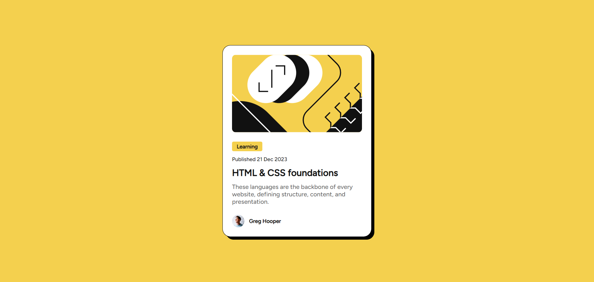
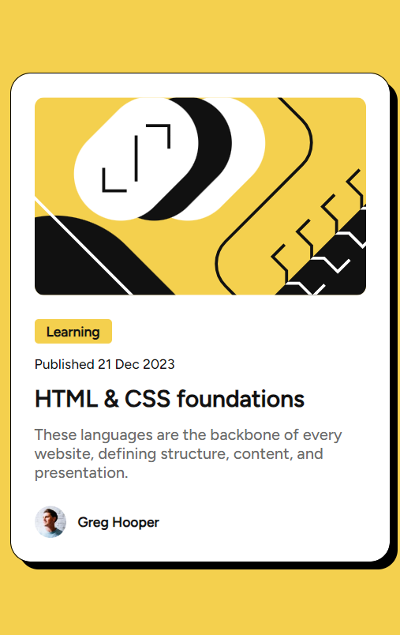

# Frontend Mentor - Blog preview card solution

This is a solution to the [Blog preview card challenge on Frontend Mentor](https://www.frontendmentor.io/challenges/qr-code-component-iux_sIO_H). Frontend Mentor challenges help you improve your coding skills by building realistic projects. 

## Table of contents

- [Overview](#overview)
  - [Screenshot](#screenshot)
  - [Links](#links)
- [My process](#my-process)
  - [Built with](#built-with)
  - [What I learned](#what-i-learned)
  - [Continued development](#continued-development)
  - [Useful resources](#useful-resources)
- [Author](#author)

## Overview
A simple blog card challenge by frontend mentor.

### Screenshot

### Desktop view

### Mobile view

### Links

- Solution URL: [Add solution URL here](https:/blog-preview-card-mchv.vercel.app/)
- Live Site URL: [Add live site URL here](https://blog-preview-card-mchv.vercel.app/)

## My process

### Built with

- Semantic HTML5 markup
- CSS custom properties
- Flexbox
- CSS Grid
- Mobile-first workflow

### What I learned

-Tried BEM(Block Element Modifier) CSS for the first.

### Continued development

I wanted to continue this to be more focused on grid, variables and responsiveness to achieve the best results.

### Useful resources

- [w3schools](https://www.w3schools.com/) - For revision of css grid.

## Author

- Frontend Mentor - [@manish2120](https://www.frontendmentor.io/profile/manish2120)
