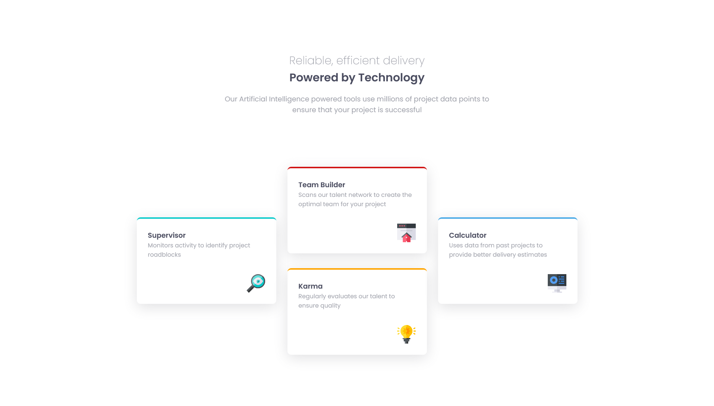

# Frontend Mentor - Four card feature section solution

This is a solution to the [Four card feature section challenge on Frontend Mentor](https://www.frontendmentor.io/challenges/four-card-feature-section-weK1eFYK).

## Table of contents

- [Overview](#overview)
  - [The challenge](#the-challenge)
  - [Screenshot](#screenshot)
  - [Links](#links)
  - [Built with](#built-with)
- [Author](#author)

## Overview
* Started with a mobile-first design approach for the first time.

### The challenge

Users should be able to:

- View the optimal layout for the site depending on their device's screen size

### Screenshot

### Desktop view

### Mobile view

### Links

- Solution URL: [Solution](https://github.com/manish2120/Frontend-Mentor-Projects/tree/main/four-card-feature-section)
- Live Site URL: [Preview](https://four-card-feature-section-mchv.vercel.app)

### Built with

- Semantic HTML5 markup
- CSS custom properties
- Flexbox
- CSS Grid
- BEM CSS
- Mobile-first workflow

## Author

- Frontend Mentor - [@manish2120](https://www.frontendmentor.io/profile/manish2120)