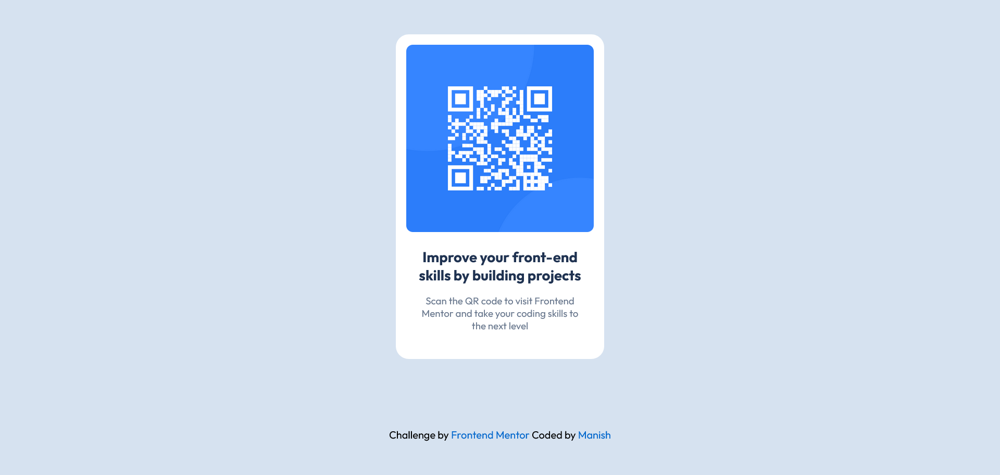

# Frontend Mentor - QR code component solution

This is a solution to the [QR code component challenge on Frontend Mentor](https://www.frontendmentor.io/challenges/qr-code-component-iux_sIO_H). Frontend Mentor challenges help you improve your coding skills by building realistic projects. 

## Table of contents

- [Overview](#overview)
  - [Screenshot](#screenshot)
  - [Links](#links)
- [My process](#my-process)
  - [Built with](#built-with)
  - [What I learned](#what-i-learned)
  - [Continued development](#continued-development)
  - [Useful resources](#useful-resources)
- [Author](#author)

## Overview

### Screenshot

### Desktop view

### Mobile view

### Links

- Solution URL: [Add solution URL here](https://qr-code-component-mchv.vercel.app/)
- Live Site URL: [Add live site URL here](https://qr-code-component-mchv.vercel.app/)

## My process

### Built with

- Semantic HTML5 markup
- CSS custom properties
- Flexbox
- CSS Grid
- Mobile-first workflow

### What I learned

I already knew something about font face but i took a look little more into it while doing this project, and i got to know as per GDPR regulation google helper fonts is quite good and effective to use.
It might not be faster then google fonts but it has some beneficial things :
1. Self hosting fonts.
2. Secured and prevent third party intervention.
3. Varieties of customization.

### Continued development

I wanted to continue this to be more focused on styling and best practices to achieve best results.

### Useful resources

- [GPT](https://chatgpt.com/) - Always a best guidance partner when it comes to get more detailed information about things.

## Author

- Frontend Mentor - [@manish2120](https://www.frontendmentor.io/profile/manish2120)
