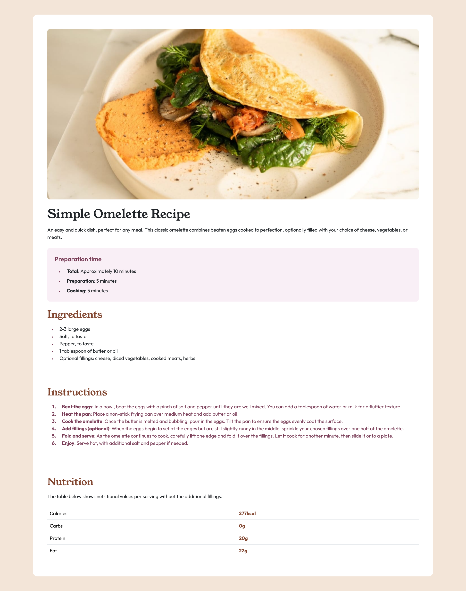
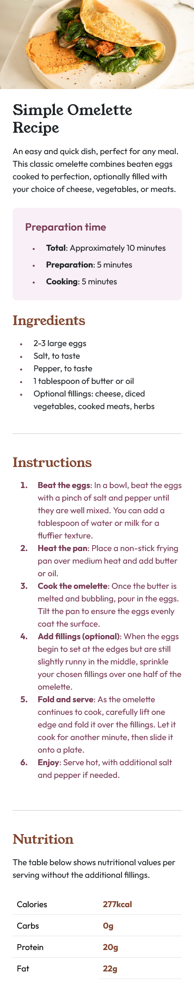

# Recipe page solution

## Table of contents

- [Overview](#overview)
  - [The challenge](#the-challenge)
  - [Screenshot](#screenshot)
  - [Links](#links)
- [My process](#my-process)
  - [Built with](#built-with)
  - [What I learned](#what-i-learned)
  - [Continued development](#continued-development)
  - [Useful resources](#useful-resources)
- [Author](#author)

## Overview

### Screenshot

### Links

- Solution URL: [Code](https://github.com/manish2120/Frontend-Mentor-Projects/tree/main/recipe-page)
- Live Site URL: [Preview](https://recipe-page-mchv.vercel.app)

## My process

### Built with

- Semantic HTML5 markup
- CSS custom properties
- Flexbox
- CSS Grid
- [Bootstrap](https://getbootstrap.com/) - CSS framework

### What I learned

It helped refresh my knowledge of Bootstrap classes.

### Continued development

I always want to be more specific and precise with my class names and semantics, but I tend to focus too much on CSS. It often feels like I mess things up. It took me a lot of time to complete this project initially, and later, when I saw others using tags like table, figure, or figcaption, I realized I had made a lot of mistakes. I always wanted to take a better approach with CSS, but sometimes it made things worse. This is something I want to improve.

## Author

- Frontend Mentor - [@manish2120](https://www.frontendmentor.io/profile/manish2120)