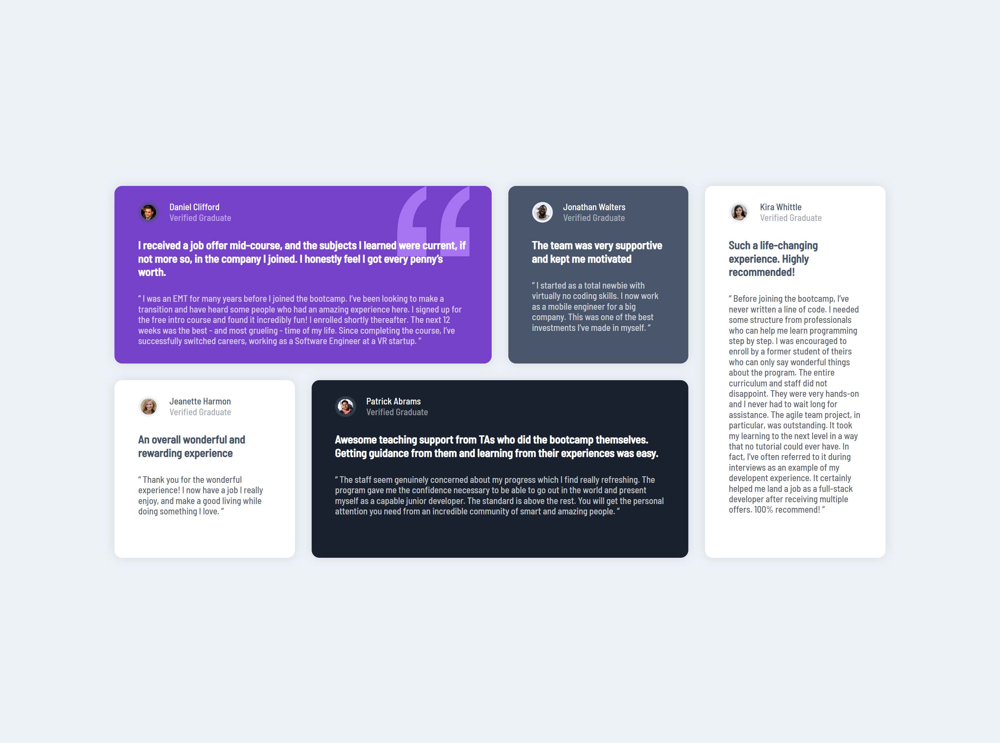

# Frontend Mentor - Testimonials grid section solution

This is a solution to the [Testimonials grid section challenge on Frontend Mentor](https://www.frontendmentor.io/challenges/testimonials-grid-section-Nnw6J7Un7). 

## Table of contents

- [Overview](#overview)
  - [The challenge](#the-challenge)
  - [Screenshot](#screenshot)
  - [Links](#links)
- [My process](#my-process)
  - [Built with](#built-with)
  - [What I learned](#what-i-learned)
  - [Continued development](#continued-development)
  - [Useful resources](#useful-resources)
- [Author](#author)

## Overview

### The challenge

Users should be able to:

- View the optimal layout for the site depending on their device's screen size

### Desktop view

### Mobile view

### Links

- Solution URL: [Solution](#)
- Live Site URL: [Live Preview](https://testimonials-grid-section-mchv.vercel.app/)

## My process

### Built with

- Semantic HTML5 markup
- CSS custom properties
- Flexbox
- CSS Grid
- Mobile-first workflow
- Pure HTML & CSS

### What I learned
I used to work with flex alot I always wanted to get used to with grids as i think its really powerfull more than flex so, yea just gave it a try.

### Continued development
 I really gonna try more focusing on grids in coming projects.

### Useful resources
- [w3schools](https://www.w3schools.com/)

## Author

- Frontend Mentor - [Profile](https://www.frontendmentor.io/profile/manish2120)